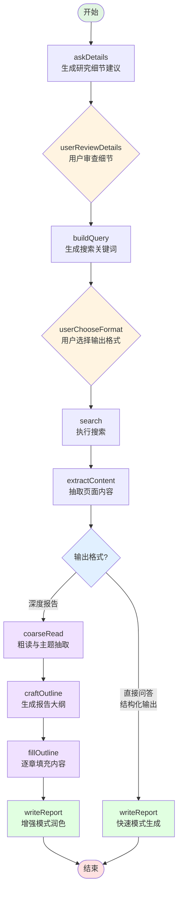
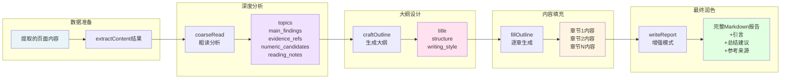
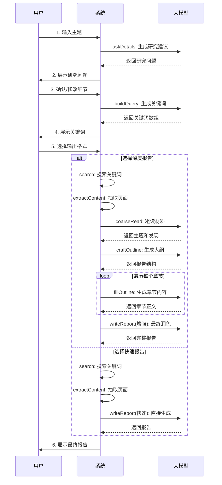
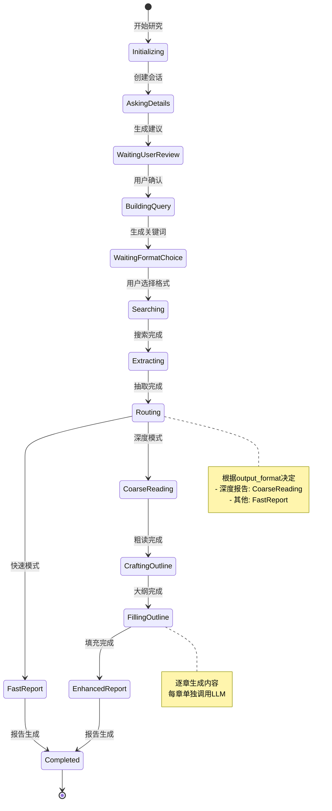
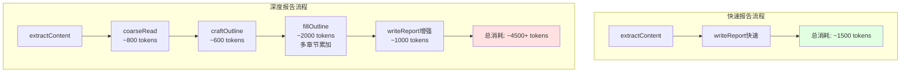

# 深度研究工作流程图

## 完整流程图



## 深度报告流程详解



## 节点数据流



## 状态机视图



## Token 消耗对比



## 关键决策点

### 1. 路由决策（routeAfterExtract）

```typescript
if (output_format === "深度报告") {
    → coarseRead  // 启动深度分析流程
} else {
    → writeReport // 直接快速生成
}
```

### 2. writeReport 智能模式

```typescript
if (存在 fillOutline 和 craftOutline 结果) {
    → 使用增强版 prompt（利用章节内容和大纲）
} else {
    → 使用快速版 prompt（直接从提取内容生成）
}
```

## 时间估算

| 阶段           | 快速模式  | 深度模式         |
| -------------- | --------- | ---------------- |
| askDetails     | ~5秒      | ~5秒             |
| buildQuery     | ~3秒      | ~3秒             |
| search         | ~10秒     | ~10秒            |
| extractContent | ~20秒     | ~20秒            |
| coarseRead     | -         | ~8秒             |
| craftOutline   | -         | ~6秒             |
| fillOutline    | -         | ~30秒（5章×6秒） |
| writeReport    | ~10秒     | ~10秒            |
| **总计**       | **~48秒** | **~92秒**        |
